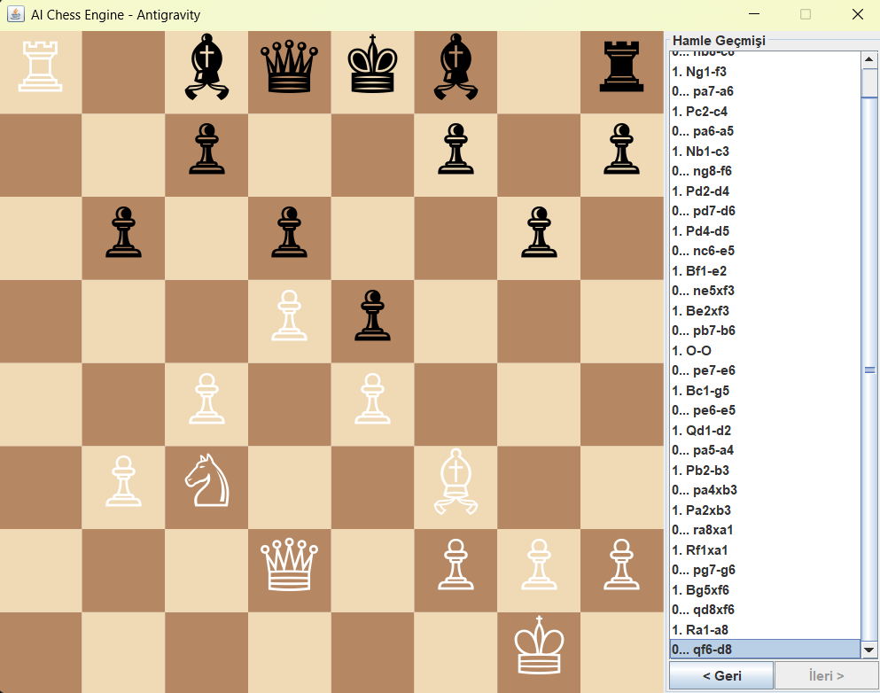

# AI Chess Engine - Antigravity ♟️



Gelişmiş veri yapıları ve algoritmalar kullanılarak **Java** ile sıfırdan geliştirilmiş, turnuva kurallarına uygun olarak çalışan yapay zeka destekli satranç motorudur. Görsel arayüzü sayesinde fare ile etkileşimli oyun imkanı sunarken, standart **UCI (Universal Chess Interface)** protokolünü desteklemesi sayesinde profesyonel satranç arayüzleriyle de (Arena, Lichess) uyumlu çalışabilir.

## 🚀 Öne Çıkan Özellikler

*   **Bitboard Optimizasyonu (64-bit):** Satranç tahtasındaki taşların konumu `long` tam sayıları olarak hafızada tutularak inanılmaz hızlı bit düzeyinde operasyonlar gerçekleştirilir.
*   **Tam Yasal (Legal) Hamle Üretimi:** Taşlar sadece pseudo-legal (gidebileceği yerler) olarak değil; açmaz (pin) durumları, şah çekilme durumu ve mat olma kısıtlamalarına göre filtrelenerek tamamen satranç kurallarına uygun bir oyun sunar.
*   **Arama Algoritmaları (Search):**
    *   Yapay zeka, oyun ağacını taramak için **Minimax** algoritması ve **Alpha-Beta Pruning (Budaması)** kullanır.
    *   "Ufuk Etkisi"ni engellemek için **Quiescence Search (Durgunluk Araması)** entegre edilmiştir.
    *   Budamanın verimliliğini artırmak için yakalama (capture) hamleleri her zaman ilk sırada incelenir (**Move Ordering**).
*   **Java Swing GUI:** Satranç oyununu terminalden bağımsız olarak oynamanızı sağlayan, hamle geçmişini gösteren ve görsel gezinme imkanı sunan grafiksel arayüz.
*   **PGN ve Blunder Analizi:** Harici olarak verilen PGN oyun dosyalarını adım adım tarayıp motor değerlendirmesi ile kritik hataları (blunder) bulan altyapı.

## 🛠️ Kurulum ve Çalıştırma

Projeyi çalıştırmak için bilgisayarınızda **Java (JDK 17 veya üzeri)** yüklü olmalıdır.

### Windows Üzerinde Hızlı Başlatma
Proje dizininde yer alan kısayolları kullanarak anında oyuna başlayabilirsiniz:
1. `run.bat` dosyasına çift tıklayın.
2. Veya terminal üzerinden PowerShell ile `.\run.ps1` komutunu çalıştırın.

### Maven Kullanarak Derleme
Sisteminizde Maven yüklüyse:
```bash
mvn clean compile assembly:single
java -jar target/ai-chess-engine-1.0-SNAPSHOT-jar-with-dependencies.jar
```

## 🎮 Nasıl Oynanır?
*   Uygulama açıldığında **Beyaz** taşlar sizin kontrolünüzdedir.
*   Oynamak istediğiniz taşa fareyle tıkladığınızda gidebileceğiniz kurallara uygun kareler yeşil bir daireyle gösterilir.
*   Hamlenizi yaptıktan sonra sıra yapay zekaya (Siyah) geçer. Motor arka planda düşünürken arayüz donmaz.
*   Sağ taraftaki **Hamle Geçmişi** panelinden oyunun kaydını satranç notasyonuna (Örn: `1. e4 e5`) uygun olarak görebilir, `Geri` ve `İleri` tuşlarıyla geçmiş konumları inceleyebilirsiniz.
*   Şah-Mat veya Pat durumu oluştuğunda oyun otomatik olarak sona erer.

## 📂 Proje Yapısı

*   `board/`: Tahta yönetimi, FEN dönüştürmeleri, 16-bit Hamle (`Move`) ve 64-bit hafıza fonksiyonları (`BitboardUtils`).
*   `movegen/`: Kayan, zıplayan taşların saldırı yönleri ve yasal hamle filtreleme motoru.
*   `search/`: Değerlendirme fonksiyonu (PST tabloları) ve yapay zeka arama ağaçları.
*   `uci/`: Harici programlarla haberleşmeyi sağlayan Universal Chess Interface işleyicisi.
*   `gui/`: Java Swing bileşenlerinden oluşan yerleşik görsel arayüz.
*   `pgn/`: `.pgn` dosyalarını okuyup motor vasıtasıyla kritik hata tespiti yapan yapı.

---
*Geliştirici: Antigravity AI*
